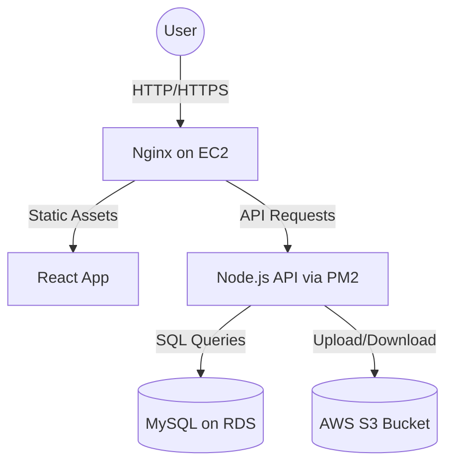

# AWS Infrastructure Setup Guide

This guide details the steps to configure the necessary AWS infrastructure for CampusVault.

## Architecture Overview

## STEP 1: Create IAM User
1. Go to **AWS IAM Console** > **Users** > **Add users**.
2. Name the user (e.g., `campusvault-admin`).
3. Under Permissions, attach the following policies directly:
   - `AmazonS3FullAccess`
   - `AmazonRDSFullAccess`
   - `AmazonEC2FullAccess`
4. Complete the creation and create an **Access Key**. Store the `Access Key ID` and `Secret Access Key` securely.

## STEP 2: Create S3 Bucket
1. Go to **AWS S3 Console** > **Create bucket**.
2. Name: `campusvault-storage` (must be globally unique).
3. Region: Select your preferred region (e.g., `us-east-1`).
4. **Object Ownership**: ACLs disabled.
5. **Block Public Access**: Turn **OFF** "Block all public access" if you want files to be publicly readable, OR keep it ON and use Presigned URLs (recommended for CampusVault).
6. Click **Create bucket**.

## STEP 3: Create RDS MySQL Database
1. Go to **AWS RDS Console** > **Create database**.
2. Choose **Standard create** > **MySQL**.
3. Templates: **Free tier** (or Production if needed).
4. Settings:
   - DB instance identifier: `campusvault-db`
   - Master username: `admin`
   - Master password: `<secure-password>`
5. Storage: 20GB gp2.
6. Connectivity: Ensure **Public access** is `Yes` (for easier local testing) or `No` (if you will only access via EC2). Set up VPC Security Group to allow inbound traffic on port `3306`.
7. Click **Create database**. Note down the Endpoint once it becomes available.

## STEP 4: Launch EC2 Instance
1. Go to **AWS EC2 Console** > **Launch instances**.
2. Name: `campusvault-server`.
3. OS: **Ubuntu 22.04 LTS**.
4. Instance type: `t2.micro` (Free tier eligible).
5. Key pair: Create a new key pair (e.g., `campusvault-key.pem`) and download it.
6. Network settings:
   - Allow SSH traffic (Port 22)
   - Allow HTTP traffic (Port 80)
   - Allow HTTPS traffic (Port 443)
7. Edit security group later to allow Port `5000` (for direct API access if needed, though Nginx on port 80 is preferred).
8. Click **Launch instance**.

## Storage Backup Configuration
To ensure data safety:
1. S3 automatically replicates data across multiple AZs. For extra safety, enable **Bucket Versioning** in S3 settings.
2. RDS provides automated backups. Ensure the backup retention period in RDS is set to at least 7 days.
